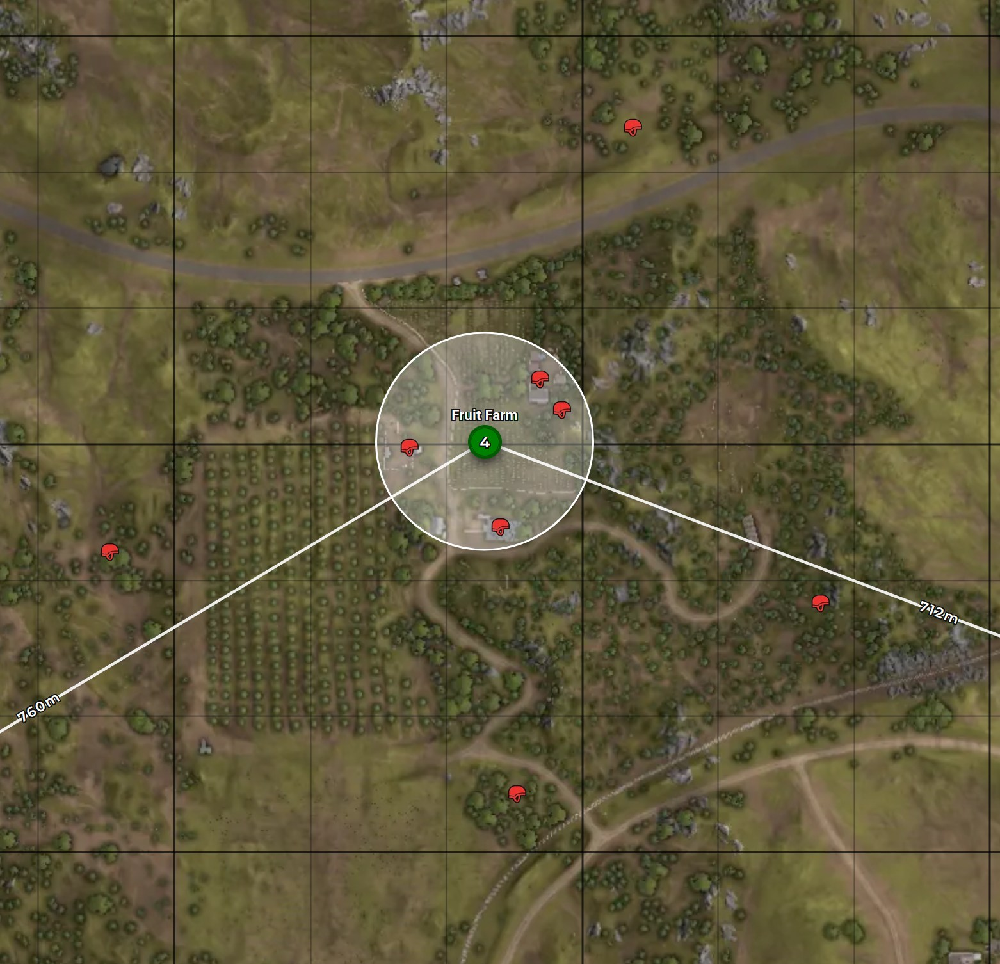

# Tactics

# Leap Frogging

Leap Frogging in a R/AAS sense is when two Squads or groups of players leap-frog between points to capture them. For example: An Attacking Squad captures the next objective, those Attacers become that Objective's Defenders, while the previous Defending Squad becomes the next Objective's Attackers.
This leaves Objectives defended at all times, and preserves unit cohesion.

# Screening

When defending an Objective, it is often good to spread out along the edges of objective to act as an early warning for enemy attacks, even if it is somewhat far away from the expected axis of push.
This can be essential to ensuring an objective isn't overran by a witful enemy, and makes sure you aren't caught off guard. This is a several-person job, and can't be completely fulfilled by one person; a forest surrounding
an Objective will need more people screening more directions than an objective surrounded by a desert, which can often be sufficiently screened by two or three people.

Even if you're the only person screening, it can often be enough. Think about where enemies may place FOBs to push from, such as a nearby farmstead, patch of forest, or other strategic location, and lie in ambush to provide early warning to your team, and offer some resistance.
Despite this, don't push too far away from your Squad and inform them of your intentions. If you are too far away and the enemy attacks your defenses from a different, unexpected direction, you may be too far to offer any meaningful resistance before it's too late.

Screening is one of the most powerful and underlooked defensive tactics in Squad, and is a great way for an unexperienced enemy to find themselves bewildered and confused by your presence in an area they thought to be safe.

An example of Screening, courtesy of squadcalc.app

Screening can catch enemy Squads on the move, lone wolfing infantry harassing your FOB, and enemy Squads in the back of logis trying to place Radios.
In the case of the later, it might be optimal to wait for the enemy to place the radio before attacking and revealing yourself, this can often result in Squad Wipes that resrult in an undefended enemy Radio that you and your team can dig down to deplete the enemy of a prescious 20 tickets.

The job of a Screen isn't to provide **enough** resistance, it's to provide provide early warning, and potentially enough resistance for the rest of your Squad and other players to move over.

